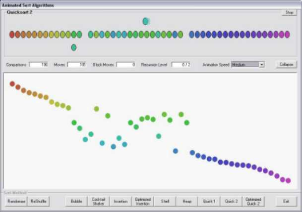



## Sort your eastereggs by color

### Description

Animated Sort Algorithms ---

Shows the behavior of these sorts: *Bubble*, *Cocktail Shaker*, *Insert*, *Improved Insert*, *Shell*, *Heap*, and three versions of *Quick". Download is 7.5 kB. Have fun...
 
### More Info
 

             |
---                |---
**Submitted On**   |2007-04-10 01:35:30
**By**             |[ULLI](https://github.com/Planet-Source-Code/PSCIndex/blob/master/ByAuthor/ulli.md)
**Level**          |Intermediate
**User Rating**    |5.0 (120 globes from 24 users)
**Compatibility**  |VB 6\.0
**Category**       |[Miscellaneous](https://github.com/Planet-Source-Code/PSCIndex/blob/master/ByCategory/miscellaneous__1-1.md)
**World**          |[Visual Basic](https://github.com/Planet-Source-Code/PSCIndex/blob/master/ByWorld/visual-basic.md)
**Archive File**   |[Sort\_your\_2059704112007\.zip](https://github.com/Planet-Source-Code/ulli-sort-your-eastereggs-by-color__1-68316/archive/master.zip)

